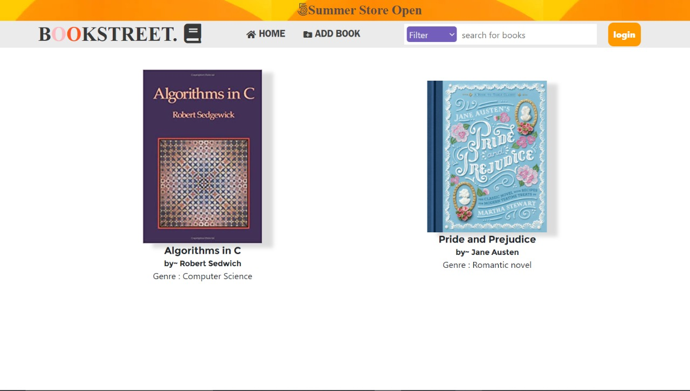

## BOOK STREET

Book Street is an online platform where you can add books review others books and rate them.This can be mostly related with [goodreads](https://www.goodreads.com/),but here in addition to viewing books online you can add them also.

### What it can do

Book street app lets ,

-   User to create an account,
-   Can add books with isbn number,title,genre,author etc,
-   Can see other users books,rate them and can review it,
-   Have a user managment sysytem,
-   Can edit account details,

### Team Members

1. [Anandu.S](https://github.com/anandukch)
2. [Adarsh P Sunil](https://github.com/adarshpsunil)

### Team Id

**BFH/recQCUy2L7nFwRofa/2021**

### Where is the app

Its here online [Book Street](https://book-street-app.herokuapp.com/)

### Libraries Used

- nodejs express
- Mongodb

### How to Run the App locally

1. Clone the repo by typing in `https://github.com/anandukch/             Book-review-platform.git `
2. Install node modules, `npm install`
3. Add a **.env** file which contains your credentials.
    
4. Start the app, `npm run dev`

          

### Demo Web Interface

    
    
    
    
    

    
